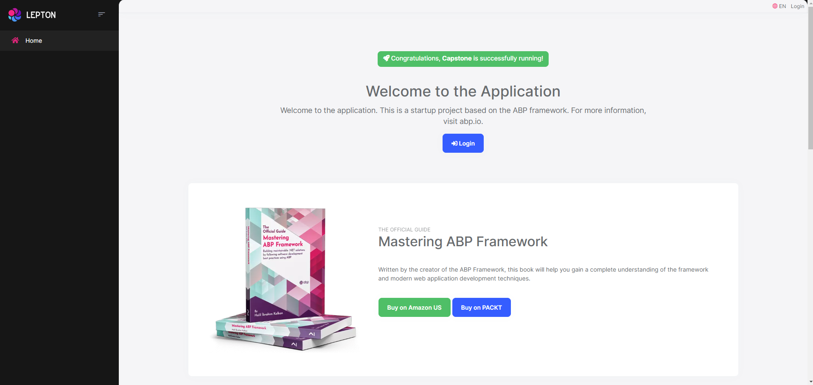

[](https://circleci.com/gh/tam892007/devops-capstone)

# Udacity Cloud DevOps Capstone

A .NET Blazor Server web based on [ABP.IO](https://abp.io/) with CircleCI for CI/CD Pipeline which containerizes & deploys to a Minikube cluster hosted in EC2 instance.

## Screenshots



## Getting Started

You can build and run the source code locally using docker compose.

```powershell
docker-compose build
docker-compose up
```